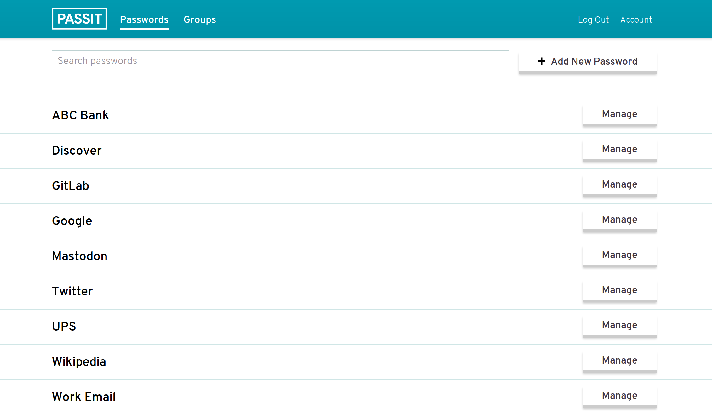

# Passit CI/CD pipeline

Deploy Passit server with CI/CD on Elestio

 
 

# Once deployed ...

You can open Passit UI here:

    URL: https://[CI_CD_DOMAIN]

You can open pgAdmin web UI here:

    URL: https://[CI_CD_DOMAIN]:10487
    Login: [ADMIN_EMAIL]
    password: [ADMIN_PASSWORD]

# First use

You will need to register at https://[CI_CD_DOMAIN]/account/register to receive your confirmation code by email and also to be able to download your Backup Code
